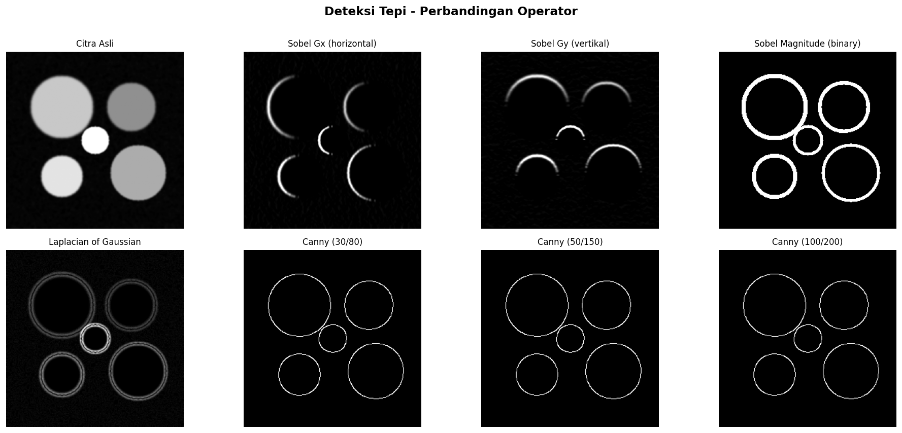

# Program Segmentasi Citra 

Program ini merupakan implementasi berbagai metode **segmentasi citra** menggunakan Python. Tujuan utama dari program ini adalah untuk memahami dan membandingkan beberapa teknik segmentasi yang umum digunakan dalam pengolahan citra digital.

Program dibuat menggunakan library:
1. OpenCV
2. NumPy
3. Matplotlib
4. Scikit-image
5. SciPy

## Deskripsi Umum

Program ini bekerja dengan membuat **citra sintetis** sebagai data uji, kemudian menerapkan beberapa metode segmentasi, yaitu:

1. Thresholding  
2. Region Growing  
3. Deteksi Tepi (Edge Detection)  
4. K-Means Clustering  
5. Watershed Segmentation  
6. Evaluasi Segmentasi  

Setiap modul menghasilkan output berupa gambar yang disimpan secara otomatis.

## Struktur Program

Program terdiri dari beberapa bagian utama:

### 1. Utilitas Umum
Berisi fungsi dasar yang digunakan di seluruh program:
- `buat_citra_sintetis()` → Membuat citra uji dengan noise dan objek lingkaran
- `tampilkan_hasil()` → Menampilkan dan menyimpan hasil visualisasi

## Modul Segmentasi

1. INPUT DATA (CITRA SINTETIS)
 

### Modul 1: Thresholding

Metode yang digunakan:
- Global Threshold
- Otsu Threshold
- Adaptive Threshold

Input:
```php
img = buat_citra_sintetis(ukuran=256)
```

Penjelasan:

Metode ini mengubah citra grayscale menjadi citra biner berdasarkan nilai ambang (threshold).  
Otsu digunakan untuk menentukan threshold optimal secara otomatis, sedangkan adaptive threshold digunakan untuk kondisi pencahayaan tidak merata.

Tujuan :

Mensimulasikan data nyata agar algoritma bisa diuji tanpa dataset eksternal

📥 Input

Citra grayscale

⚙️ Proses

🔹 Global Threshold
```php
cv2.threshold(img, 128, 255, cv2.THRESH_BINARY)
```
Pakai nilai tetap (128)

🔹 Otsu

```php
cv2.threshold(img, 0, 255, cv2.THRESH_OTSU)
```
Mencari threshold optimal otomatis

🔹 Adaptif
```php
cv2.adaptiveThreshold(...)
```
Threshold berbeda tiap area


Output:
- Histogram intensitas 


- Hasil perbandingan threshold
  


### Modul 2: Region Growing

📥 Input

Citra grayscale + seed point

⚙️ Proses

1. BFS (Breadth First Search)

2. Pixel ditambahkan jika:
```php
|I(pixel) - I(seed)| <= threshold
```

Penjelasan:
Metode ini memulai segmentasi dari titik awal (seed), kemudian memperluas area ke piksel tetangga yang memiliki intensitas serupa.

Ciri utama:
- Menggunakan algoritma BFS (Breadth-First Search)
- Bergantung pada threshold perbedaan intensitas
- Sensitif terhadap pemilihan seed

Output:
- Eksperimen beberapa seed 


### Modul 3: Deteksi Tepi (Edge Detection)

Metode yang digunakan:
- Sobel
- Laplacian of Gaussian (LoG)
- Canny

Penjelasan:
Digunakan untuk mendeteksi batas objek berdasarkan perubahan intensitas (gradien).

📥 Input

Citra grayscale

⚙️ Proses

🔹 Sobel
Hitung gradien:

```php
Gx = cv2.Sobel(...)
Gy = cv2.Sobel(...)

gabung 

magnitude = sqrt(Gx^2 + Gy^2)
```

Output:
- Hasil deteksi tepi 


### Modul 4: K-Means Clustering

Penjelasan:
Mengelompokkan piksel ke dalam K cluster berdasarkan kemiripan nilai intensitas.

📥 Input

Intensitas piksel

⚙️ Proses
```php
cv2.kmeans(data, K, ...)
```
Setiap piksel → data point
Dikelompokkan ke K cluster

Karakteristik:
- Tidak membutuhkan seed
- Bergantung pada jumlah cluster (K)

Output:
- Perbandingan K=2,3,4


### Modul 5: Watershed Segmentation

Penjelasan:
Metode ini memandang citra sebagai permukaan topografi dan melakukan segmentasi berdasarkan simulasi aliran air.

Tahapan:
1. Thresholding (biner)
2. Distance transform
3. Penentuan marker
4. Proses watershed

Kelebihan:
- Mampu memisahkan objek yang saling menempel

Output:
- Hasil watershed


---

### Modul 6: Evaluasi Segmentasi

Penjelasan:
Digunakan untuk mengukur performa hasil segmentasi dengan membandingkan hasil prediksi dengan ground truth.

📥 Input
Ground truth (GT)
Prediksi (A, B, C, D)

⚙️ Proses (Metrik)

🔹 Pixel Accuracy
jumlah pixel benar / total pixel

🔹 IoU
intersection / union

🔹 Dice

2 * intersection / (total area)

🔹 Precision & Recall
Precision → TP / (TP + FP)
Recall → TP / (TP + FN)

Metrik yang digunakan:
- **IoU (Intersection over Union)**
- **Dice Coefficient**

Output:
- Visualisasi evaluasi


- Nilai IoU=0.910, Dice=0.953

## Kesimpulan

Program ini menunjukkan bahwa:
- Setiap metode segmentasi memiliki karakteristik yang berbeda
- Tidak ada metode yang selalu terbaik untuk semua kasus
- Kombinasi metode dapat menghasilkan hasil yang lebih optimal

Evaluasi menggunakan IoU dan Dice menunjukkan bahwa hasil segmentasi memiliki akurasi yang tinggi.
